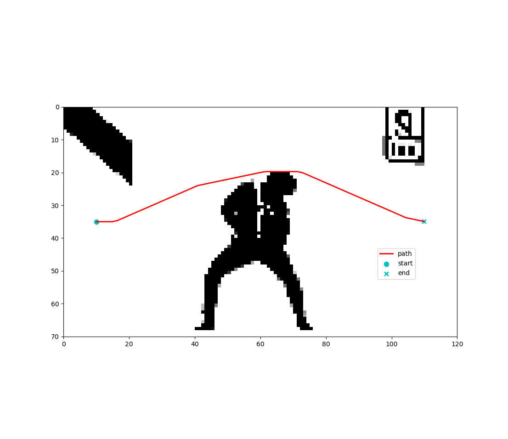
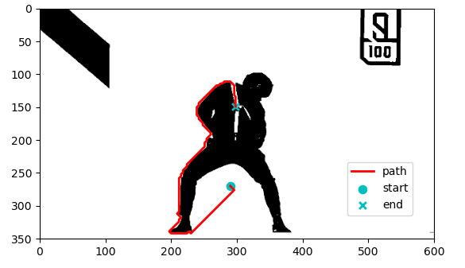
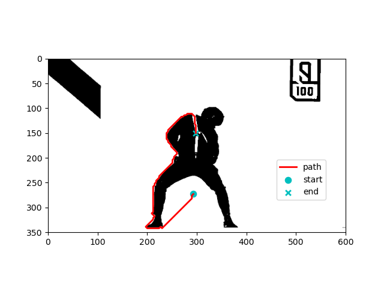
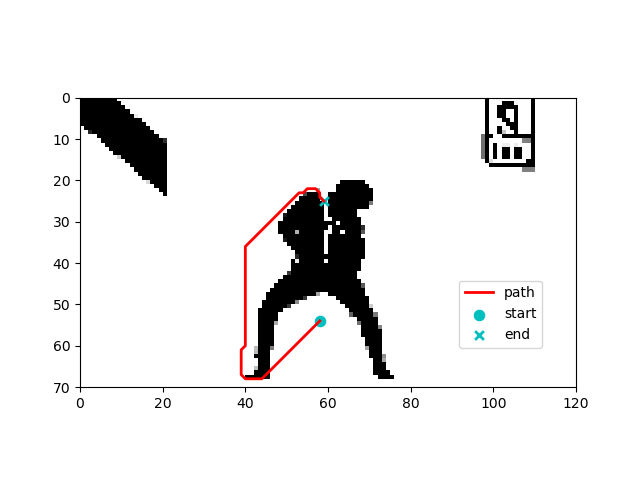
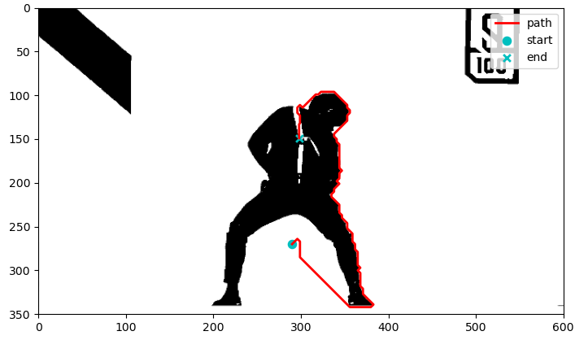
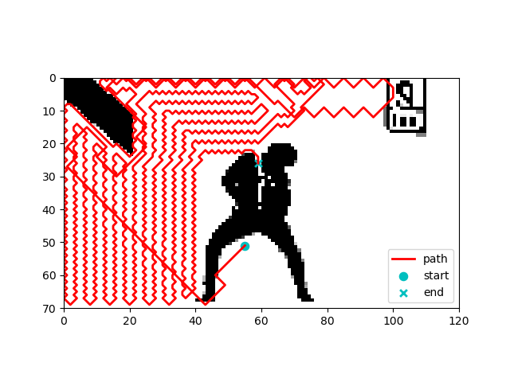
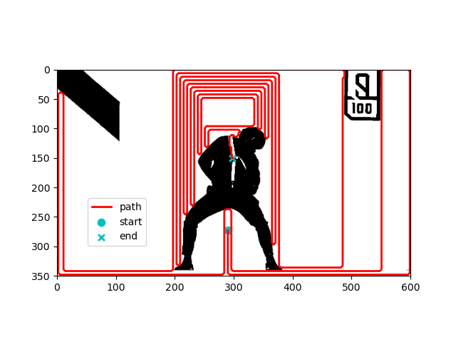

# 路径规划算法

## 算法:

| 算法                                                         | file        | 类别                | 性质      | OpenList数据结构 |
| ------------------------------------------------------------ | ----------- | ------------------- | --------- | ---------------- |
| A星算法 (A*)                                            | A_star.py   | 启发搜索 F=G+H | 最优+最速 | PriorityQueue    |
| 混合A星算法 (Hybrid A*) | HybridA_star.py | 启发搜索 F=G+H | 考虑车辆运动学约束 | PriorityQueue |
| 迪杰斯特拉搜索算法 (Dijkstra)                           | Dijkstra.py | 启发搜索 F=G   | 最优      | PriorityQueue    |
| 贪婪最佳优先搜索算法 (Greedy Best First Search, GBFS)   | GBFS.py     | 启发搜索 F=H   | 最速      | PriorityQueue    |
| 广度优先搜索算法 (Breadth First Search, BFS)            | BFS.py      | 遍历搜索            | 最优      | deque 先入先出   |
| 深度优先搜索算法 (Depth First Search, DFS)              | DFS.py      | 遍历搜索            | 最速      | list 后入先出   |
| 概率路图算法 (Probabilistic Road Map, PRM)              |             | 采样                |           |                  |
| 快速随机扩展树算法 (Rapidly-exploring Random Tree, RRT) |             | 采样                |           |                  |

###### 备注：

* 原版 PriorityQueue：无法更新Node，路径较长，但搜索速度贼快
* set版 PriorityQueue：动态更新Node，路径最短，速度接近或超过优先队列（要求Node可hash）
* list版 PriorityQueue：动态更新Node，路径最短，速度最慢（in和pop时间复杂度比set的in和remove大）

## 用法:

* 在草纸上随便画点障碍物，拍照上传替换鲲鲲图片 image.jpg，在 A_star.py 等脚本中设置起点终点等参数，运行即可.
* 程序并没有设置复杂的继承/依赖关系，只需要如 common.py  + A_star.py + image.jpg 三个文件在同一目录就能运行.

## 效果:

**复杂障碍物地图下的路径规划结果（只能看一眼，不然会爆炸）**

### 混合A*算法：（考虑车辆运动学约束）

### A*算法：（介于最优和快速之间）

* List耗时0.67s，Set耗时0.45s，PriorityQueue耗时0.48s，步长3
* 由于List/Set存储结构能动态更新OpenList中Node的cost和parent信息，路径会更优

###### List/Set存储结构：

###### PriorityQueue存储结构：

### Dijkstra算法：（最优路径，耗时较大）

* List耗时81s，Set耗时15.6s，PriorityQueue耗时15s，步长3

### GBFS算法：（路径较差，速度贼快）

* List耗时0.16s，Set耗时0.12s，PriorityQueue耗时0.13s，步长3

### BFS算法：（最优路径，耗时较大）

* Deque耗时8.92s，步长3

### DFS算法：（最烂路径，速度较快）

* List耗时1.96s，步长5

* List耗时15.07s，步长3

### PRM算法：

raise NotImplementedError

### RRT算法：

raise NotImplementedError

## Requirement:

python  >= 3.9

opencv-python >= 4.7.0.72

matplotlib >= 3.5.1

numpy >= 1.22.3

###### 广告:

[DRL-for-Path-Planning: 深度强化学习路径规划, SAC路径规划](https://github.com/zhaohaojie1998/DRL-for-Path-Planning)

[Grey-Wolf-Optimizer-for-Path-Planning: 灰狼优化算法路径规划、多智能体/多无人机航迹规划](https://github.com/zhaohaojie1998/Grey-Wolf-Optimizer-for-Path-Planning)
