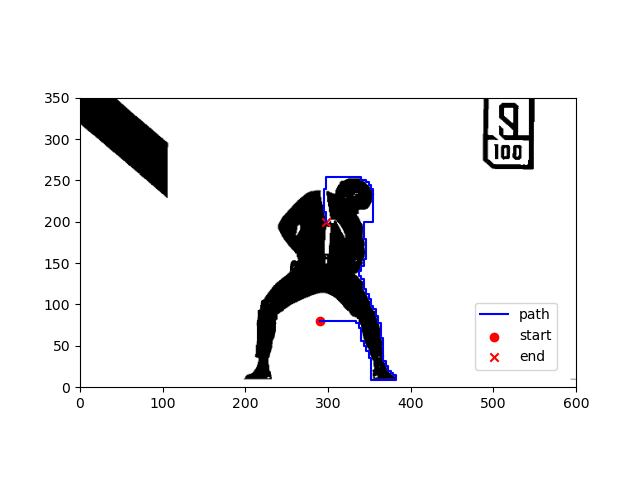

# 路径规划算法

## 算法:

| 算法               | algo                               | file        | 类别 |
| ------------------ | ---------------------------------- | ----------- | ---- |
| A星算法            | A*                                 | A_star.py   | 搜索 |
| 贪婪最佳优先算法   | Greedy Best First Search, GBFS     | GBFS.py     | 搜索 |
| 迪杰斯特拉算法     | Dijkstra（搜鸡哥地图得1k秒）       | Dijkstra.py | 搜索 |
| 深度优先搜索算法   | Depth First Search, DFS            |             | 搜索 |
| 广度优先搜索算法   | Breadth First Search, BFS          |             | 搜索 |
| 概率路图算法       | Probabilistic Road Map, PRM        |             | 采样 |
| 快速随机扩展树算法 | Rapidly-exploring Random Tree, RRT |             | 采样 |

## 使用方法:

在草纸上随便画点障碍物，拍照上传替换鲲鲲图片image.jpg，在A_star.py等脚本中设置起点终点等参数，运行即可

## 效果:

##### 复杂障碍物地图下的路径规划结果（只能看一眼，不然会爆炸）

## Requirement:

python  >= 3.9

opencv-python >= 4.7.0.72

matplotlib >= 3.5.1

numpy >= 1.22.3

###### 广告:

[DRL-for-Path-Planning: 深度强化学习路径规划, SAC路径规划](https://github.com/zhaohaojie1998/DRL-for-Path-Planning)

[Grey-Wolf-Optimizer-for-Path-Planning: 灰狼优化算法路径规划、多智能体/多无人机航迹规划](https://github.com/zhaohaojie1998/Grey-Wolf-Optimizer-for-Path-Planning)
